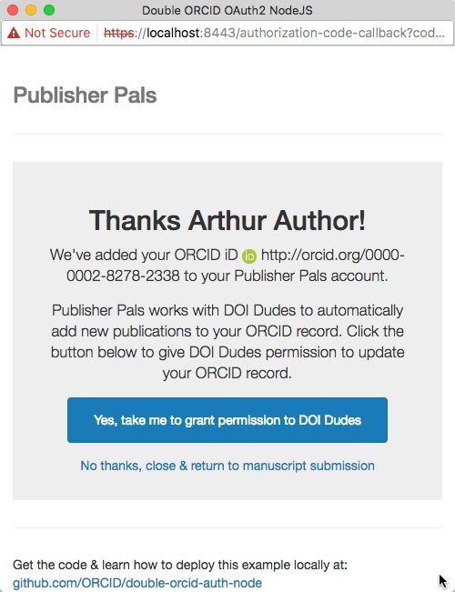
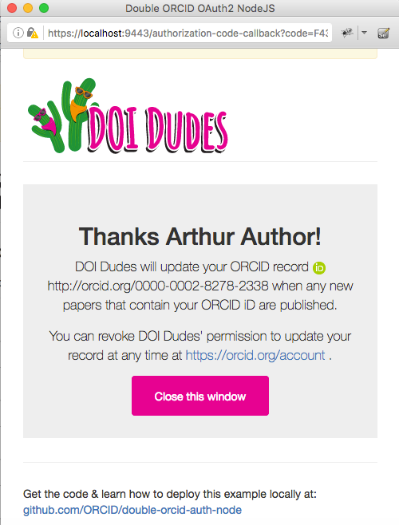

[< Back to user workflows list](user_flows.md#user-flows) 
# Case 3: DOI Dudes already has permission (with Publisher Pals redirect screen)

This demo shows a case where:

- DOI Dudes already has permission to access the user's ORCID record (ex: granted while submitting a manuscript to another journal) 
- A redirect screen is shown after user grants permission to Publisher Pals that provides info about the relationship between Publisher Pals and DOI Dudes

###1. Connect iD to Publisher Pals
On the Publisher Pals site, user clicks **Create or Connect your ORCID iD**

###2. Register/sign into ORCID & grant permission to Publisher Pals
 A request to grant Publisher Pals access to the user's ORCID record appears in a pop-up. This page is hosted by ORCID and includes information about the specific actions that Publisher Pals wants to take on the user's ORCID record.

 - **New ORCID users:** Click **Register Now**, complete the registration form and click **Authorize**
 - **Existing ORCID users:** Enter ORCID account credentials and click **Authorize**

###3. Publisher Pals confirmation message & prompt to grant permission to DOI Dudes
After granting access to Publisher Pals, the user is directed to a screen showing a confirmation message and a prompt to grant permission to DOI Dudes. This page is hosted by Publisher Pals, and Publisher Pals determines its content.

- **Yes, take me to grant permission...** Opens a request to grant DOI Dudes access to the user's ORCID record in the same window
- **No thanks...** Closes the window

###4. DOI Dudes confirmation message

Since DOI Dudes already has permission to access the user's ORCID record, no addtional request is displayed. Instead, the user is sent directly to a screen showing a confirmation message. This page is hosted by DOI Dudes, and DOI Dudes determines its content. This window should be configured to close automatically after several seconds.

###5. User returns to Publisher Pals submission system 
The user is returned to Publisher Pals to complete the submission process. Both Publisher Pals and DOI Dudes have permission to access the user's ORCID record. Publisher Pals uses its access immediately to include the user's ORCID iD with the submission; DOI Dudes uses its access to post the work to the user's ORCID record once it is published. 

[< Back to user workflows list](user_flows.md#user-flows) 
