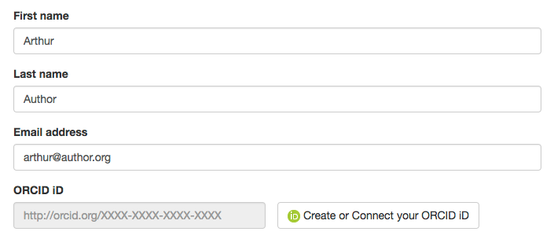
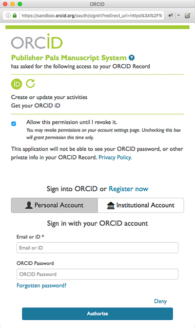

[< Back to user workflows list](user_flows.md#user-flows) 
# Case 4: DOI Dudes already has permission (without confirmation screens)

This demo shows a case where:

- DOI Dudes already has permission to access the user's ORCID record (ex: granted while submitting a manuscript to another journal) 
- No confirmation screen is shown after user grants permission to Publisher Pals - user is sent directly to DOI Dudes authorization screen
- No confirmation screen is shown after user grants permission to DOI Dudes - DOI Dudes immediately closes permission request window automatically

###1. Connect iD to Publisher Pals
On the Publisher Pals site, user clicks **Create or Connect your ORCID iD**

###2. Register/sign into ORCID & grant permission to Publisher Pals
 A request to grant Publisher Pals access to the user's ORCID record appears in a pop-up. This page is hosted by ORCID and includes information about the specific actions that Publisher Pals wants to take on the user's ORCID record.

 - **New ORCID users:** Click **Register Now**, complete the registration form and click **Authorize**
 - **Existing ORCID users:** Enter ORCID account credentials and click **Authorize**

###3. Redirect to DOI Dudes authorization (not visible to user)
Publisher Pals redirects user to DOI Dudes' permission request, but since DOI Dudes already has permission to access the user's ORCID record, no request screen is displayed. Instead, an authorization code is returned to DOI Dudes. Since DOI Dudes knows they already permission to access this user's ORCID record, they close the screen automatically without showing a message.

###4. User returns to Publisher Pals submission system 
The user is returned to Publisher Pals to complete the submission process. Both Publisher Pals and DOI Dudes have permission to access the user's ORCID record. Publisher Pals uses its access immediately to include the user's ORCID iD with the submission; DOI Dudes uses its access to post the work to the user's ORCID record once it is published. 

[< Back to user workflows list](user_flows.md#user-flows) 